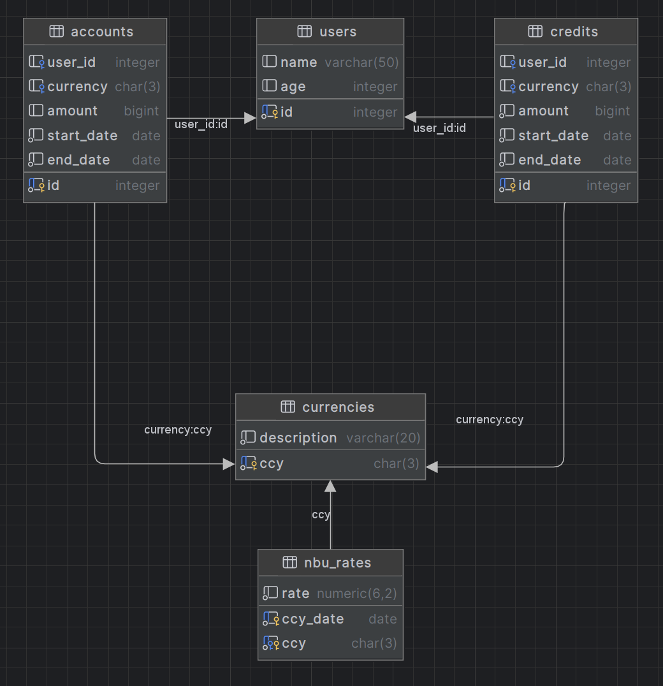

# A. Thursday SQL Warmup (***Time - 30 min.***)

### How well are you know SQL?

Go
to: [Git_ThursdayWarmup](https://github.com/AlexandrLavrinenko/codeus_practices/blob/master/src/main/java/december/thursday/README.md)
pull the project. 

## 1. Connect to a database:

Use the recorded URL to connect to your Postgres database from any external source.

- ##### URL: `jdbc:postgresql://___/codeus-postgres`
- ##### USER: `codeus`
- ##### PASSWORD: `theOneWhoGetsUpEarly`
- ##### scheme: `public`
- ##### tables: `users, accounts, nbu_rates, credits, nbu_rates, currencies`

## 2. Open file [warmup.sql](../../../resources/sql/warmup.sql) and follow to the comments.

## 3. Check your implementation with branch `completed`

# B. Thursday SQL Advanced (***Time - 30 min.***)

## 4. Open file [advanced.sql](../../../resources/sql/advanced.sql) and follow to the comments.

## 5. Check your implementation with branch `completed`

